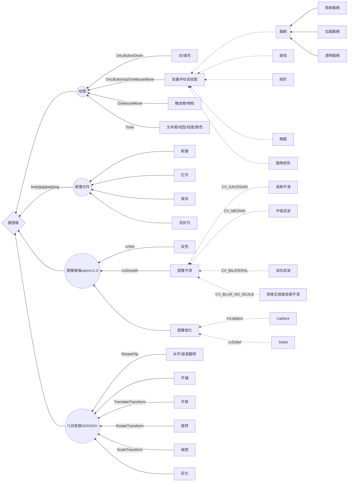

# SimpleMFCGraphics


> Developed with VC++6.0  using GDI+&opencv1.0 resources 


Feature List

--------------------------

1. Files
    - [x] New
    - [x] Open  
    - [x] Save 
    - [x] Save As
    - [ ] Print
    - [ ] Email
    - [x] Exit
 2. Edit
    - [ ] Undo
    - [ ] Repeat
    - [ ] Cut
    - [ ] Copy
    - [ ] Paste
    - [ ] Delete Selection
    - [ ] Select All
    - [ ] Copy to
    - [ ] Paste From
 3. View 
    - [x] Status Bar
    - [x] Text Edit Bar (fake)
    - [x] Zoom
        - [x] Normal
        - [x] Large
4. Tools


- [x] Irregular Selection
- [x] Rectangle Selection
- [x] Erase
- [x] Fill
- [x] Spray Gun
- [x] Brushes
- [x] Magnify
- [x] Pencil
- [x] Line
- [x] Curve
- [x] Text
- [x] Filled Rectangle
- [x] Outlined Rectangle
- [x] Filled Round Rectangle
- [x] Outlined Round Rectangle
- [x] Filled Ellipse
- [x] Outlined Ellipse

5. Settings

- [x] Line Width
- [x] Line Style
    - [x] solid
    - [x] dash
    - [x] dot
    - [x] dash-dot
    - [x] dash-dot-dot
- [x] Select Color
- [x] Select Fill Model

6. Geometric transformation

- [x] Stretch/Shrink
- [x] Flip/Rotate
- [x] Translate
- [x] Ashing
- [x] Tiling

7. Image enhancement
- [x] Anti-color
- [x] Gaussian smoothing
- [x] Median filter
- [x] Bidirectional filtering
- [x] Simple No Scaling Transform Smooth
- [x] Laplacian sharpening
- [x] Sobel sharpening

------

## 设计文档

### 设计任务

> **用VC6.0设计一个MFC单文档画图板，要求至少实现以下基本功能**

*  新建文件
*  打开/保存 bmp
*  画矩形/椭圆/直线/曲线
*  设置(边框) 线宽/线型/颜色/实心/空心
*  图像高斯平滑/灰化/旋转/缩放
*  文本框
*  双缓冲(*)

### 任务分析

> **文件操作**

* 如何新建文件？

  参考WINDOWS画图板已知新建文件仅起到清空界面的作用，文件处理在完成绘图后进行。

* 如何打开保存bmp?

  GDI+和Opencv1.0 第三方库中都包含了图像文件的打开与保存操作。

> **绘图操作**

* GDI和GDI+包含了大量成熟的绘图函数，只需按需寻找适合的函数，了解如何使用即可
* 借助双缓冲实现动态画图和窗体变化时的图像保留
* GDI+中几何变换的函数封装简洁，对比Opencv1.0，Opencv1.0在图像的平滑等操作上更为完整


### 设计思路与流程

> **设计思路**

1. 由于vc6.0 仅能配置Opencv1.0 ，所以无法通过Opencv2.0以上版本的Mat类来进行读写，文件操作设计思路更偏向于使用GDI+的Image类和Opencv1.0中的 IplImage 类综合处理， 有关保存则借助于Image的派生类Bitmap较为便捷。

2. 几何变换和图像处理总体思路是在图像的几何变换中借助于GDI+有关变换的Graphics类在Image类上实现，在图像增强处理中使用Opencv1.0的cv.h库中相关函数在IplImage 类上实现。

3. 一般的绘图操作交给GDI直接在画布上执行，同时使用双缓冲实现动态画直线、矩形、椭圆、图形变换等，使得窗体大小发生变化时图像仍能保留（参考WINDOWS画图板）。

4.  如何提高程序的扩展性，减少代码的耦合度？

   为了提高扩展性，减少重复工作，参考相关资料，在CGraphicView类中自定义了Load, GetEncoderClsid, CopyToMemDC 等等函数实现了代码重构，降低了了代码的耦合度。

5. **如何解决双缓冲下图形变换操作后换为一般图形操作导致的图形消失问题？**

* 这个问题在双缓冲背景下尚未找到完美的解决方案，通过限制图形操作和一般绘图操作的糅合来做一个改善，导入图形后需要先完成所有图形变换的操作，进行确认以后方可在图形的基础之上完成一般的绘图，也就是在确认之后将完整的变换图形绘制到MemDC中，成为画布的底图。

6. **如何同时结合图形变换的翻转、旋转、平移、缩放和灰化？**

* 由于GDI+中用于实现图形变换的Graphics类除了翻转其他都并没有对Image本身实现变换，仅仅在图像显示的时候通过Graphics类相关变换传进去的参数在DrawImage时体现出来，所以需要每次做图形变幻的时候都做好相关参数的保存，作为图形状态的记录。
* 同时双缓冲还会带来一个问题，即为图形变换时不能随意点击屏幕区域，这会导致ClientDC上变换后图形消失，因为这是与一般画图相关的操作，所以应该尽量避免。
* 在状态参数记录后完成图形状态的再现设计使用NormTrans()函数来完成，但是Graphics类本身无法通过构造函数外初始化状态也无法作为参数传递，所以无法作为CGpraphicView的成员变量使用也无法通过成员函数设置状态，导致大量使用局部变量graphics来实现的已完成的图形变换的重绘，代码大量的耦合加大了代码编辑的工作量，尚亟待改进。

7. 补充设计密码对话框和退出提示，密码有所提示。

> **功能关系设计图**




## 功能介绍

1. 文件导入保存：

   MFC支持的CFileDialog类导入图像文件信息存储在View的成员变量Image*中，在使用时通过Load调用图像信息至Image中。保存时将ClientDC的所有内容复制到MemDC中，**GetEncoderClsid**后获得存储路径Clsid，将MemDC关联的CBitmap传递给Bitmap后存储便可实现保存。

2. 建立在双缓冲上的GDI基本绘图功能：

   为每一种不同的绘图操作制定编号：点，直线，矩形，椭圆，扇形，折线，简单画刷，位图画刷，透明画刷，橡皮擦，填充，喷枪，圆角矩形依次编号，在选定操作之后将在**OnLButtonDown**，**OnLButtonUp**，**OnMouseMove**三个函数中执行基本绘图操作。其中，直线，矩形，椭圆，圆角矩形，3中画刷均含有动态绘图效果，例如画直线：在**OnMouseMove**中将MemDC内容复制到Clientdc下后进行绘图，在OnLButtonUp中直接画到MemDC关联的CBitmap中再拷贝给Clientdc,从而实现了动态绘图的效果。

3. 由GDI+支持的Image类以及Graphics提供的几何变换：

   Image类支持 RotateFlip , Graphics由对应Image类构造而来，通过TranslateTransform, ScaleTransform, TranslateTransform附加几何变化效果，通过矩阵变换实现图像灰化，并在DrawImage中表现，但除了翻转以外，Image本身并无变化，所以要将变化后的图画到MemDC才能进行基本绘图操作，即完成所有图像的变化之后进行确认并不能再做改动。

4.  由Opencv1.0支持的图像增强处理：

   在**cv.h**中包含大量图像增强函数，但犹豫版本限制都建立在IplImage上，通过调用临时存储的ClientDC的图像文件实现客户端窗口界面的全图像增强，具体由cvSmooth, cvLaplace, cvSobel, cvNot实现。

5. 窗口式的绘图设置：

   将有关线型、线宽、实心/空心的设置放在Setting对话框中，颜色的设置借助于内含的CColorDialog实现，其他一些设置还有放缩、旋转、平移的参数设定以及图像确认和密码窗口。

## 文件和对象描述

* 外部库: 

```C++
//配置GDI+
#define ULONG_PTR ULONG 
// MFC support for Internet Explorer 4 Common Controls	//此处必须添加，否则出错
#include <afxdtctl.h>
#include <atlbase.h>  //CString转WCHAR*
#include <gdiplus.h>
using namespace Gdiplus;
#pragma comment(lib, "gdiplus.lib")

//配置Opencv1.0
#include <cv.h>  
#include <cxcore.h>  
#include <highgui.h>  
#pragma comment(lib, "cv.lib")  
#pragma comment(lib, "cxcore.lib")  
#pragma comment(lib, "highgui.lib")  
```

* **CGraphicApp** 负责外部库的配置，**CGraphicDoc**存储打开的图像的路径信息以及文件类型，**CGraphicView**负责主要的绘图操作,其成员函数以及成员变量构成如下：

```c++
消息响应函数:
afx_msg void OnLButtonDown(UINT nFlags, CPoint point);//鼠标按下响应
afx_msg void OnLButtonUp(UINT nFlags, CPoint point);//鼠标抬起响应
afx_msg void OnMouseMove(UINT nFlags, CPoint point);//鼠标移动响应
afx_msg void OnLine();//选定画直线操作
afx_msg void OnRectangle();//选定画矩形操作
afx_msg void OnDot();//选定画点操作
afx_msg void OnEllipse();//选定画椭圆操作
afx_msg void OnSector();//选定画扇形操作
afx_msg void OnPolyline();//选定画折线操作
afx_msg void OnSimplebrush();//选定简单画刷
afx_msg void OnBitmapbrush();//选定位图画刷
afx_msg void OnTransparentbrush();//选定透明画刷
afx_msg void OnColor();//选定颜色设置
afx_msg void OnSetting();//选定线型、线宽、实心空心设置
afx_msg BOOL OnEraseBkgnd(CDC* pDC);//背景消除响应函数
afx_msg void OnErase();//选定颜色设置
afx_msg void OnFillarea();//选定填充操作
afx_msg void OnRotate();//选定旋转操作
afx_msg void OnPaint();//重绘消息响应函数
afx_msg void OnGray();//选定灰化操作
afx_msg void OnAll();//选定平铺操作
afx_msg void OnZoom();//选定缩放操作
afx_msg void OnTranslate();//选定平移操作
afx_msg void OnGauss();//选定高斯平滑操作
afx_msg void OnFileSave();//选定保存操作
afx_msg void OnFileSaveAs();//选定另存为操作
afx_msg void OnFileNew();//选定新建操作
afx_msg void OnText();//选定添加文本框
afx_msg int OnCreate(LPCREATESTRUCT lpCreateStruct);//初始时窗口限制最大化
afx_msg void OnMedian();//选定中值滤波操作
afx_msg void OnBilateral();//选定双边滤波操作
afx_msg void OnSimpleNoScale();//选定简单无放缩变换平滑操作
afx_msg void OnNot();//选定反色操作
afx_msg void OnLevelfilp();//选定水平翻转操作
afx_msg void OnVerticalfilp();//选定颜竖直翻转操作
afx_msg void OnLaplace();//选定Laplace图像锐化操作
afx_msg void OnSobel();//选定Sobel图像锐化操作
afx_msg void OnGun();//选定喷枪操作
afx_msg void OnRoundrect();//选定圆角矩形操作
其他函数：
virtual void OnDraw(CDC* pDC);  // overridden to draw this view

void initial();//新建画布初始化
void NormalTrans();//*几何变换（无效）
void CopyToMemDC();//将ClientDC中内容复制到MemDC中
void imageConfirmnation();//完成几何变换后进行图像确认
void imageDraw();//完成图像确认后固定图像
void sprayGun(CPoint);//喷枪
bool Load( LPCTSTR pszFileName );//加载Image操作
int GetEncoderClsid(const WCHAR* , CLSID* );//获取文件路径的Clsid测试报告
```
## 测试报告

由于对于MFC单文档应用程序尤其是画图程序不适合通过测试代码来测试运行效果，此处用截图表示：

password：


基本绘图操作：


文件打开：


文件保存(另存为)

.bmp)

几何变换


填充


反色


平滑处理


图像锐化


## 总结

​	刚开始写绘图板的时候并不知道如何下手，只是按照网上的简易绘图板教程边学边做，慢慢了解绘图板的原理，并没有清晰的设计思路，完成了最开始的设计之后就开始研究双缓冲的做法，但是研究了两天还是一头雾水，最后还是先放了一放去学习如何使用GDI+完成图像的几何变换。几何变换的效果虽然做出来了但是并没有图像的变化，文件导入保存也存在着诸多问题，一时完全不知道如何解决。到最后一周再回来看双缓冲的时候才突然明白了其中的原理，许多问题迎刃而解，文件导入保存也变得思路清晰，功能趋于稳定完整，后来用opencv1.0加上图像增强功能也是十分顺利。可以说这次从零到一开发单文档画图板是一个坎坷艰难的过程，但最后所有问题迎刃而解的豁然正是最好的快乐，过程中的自我努力和探索能换来如此多实用的知识也是让人十分开心的事。问题的解决正是一个从有到无、从未知到已知的过程，而汗水之中的乐趣也正是在这种不断前进的探索之中。


## 参考资料

2017.9.10

> [MFC画图板简易教程](https://wenku.baidu.com/view/70c94b02e53a580217fcfe5d.html)
>
> [图形格式转化](https://vctipsplusplus.wordpress.com/tag/image-conversion-gdi)
>
> [将VIEW保存为图片](http://blog.csdn.net/zhubosa/article/details/41248873)

2017.9.11

> [改变窗口的大小，视图区内的图形也会跟着变化](http://blog.csdn.net/qingdu007/article/details/28405155)
>
> [GDI+详细介绍](http://blog.csdn.net/kingcat666/article/details/44155077)
>
> [MFC打开和保存一幅bmp图片---编程流程](https://wenku.baidu.com/view/e7c320cd2cc58bd63186bdb7.html)
>
> [GDI+ 双缓冲实现和局部刷新技术](http://blog.csdn.net/htt9931/article/details/28641039)
>
> [获取HDC的方法](http://bbs.csdn.net/topics/10157110)
>
> [改变鼠标指针形状](http://bbs.csdn.net/topics/26608)
>
> [VC++双缓冲保持背景不擦除之实现](http://www.cnblogs.com/lujin49/p/4704795.html)
>
> [VC 绘图，使用双缓冲技术实现](http://blog.sina.com.cn/s/blog_4dd787e401017cl3.html)
>
> [MFC双缓冲实现闪烁的处理](http://blog.sina.com.cn/s/blog_aeaa89900101jch3.html)
>
> [MFC动态画直线-清楚上一次的线](https://zhidao.baidu.com/question/589504876.html)
>
> [MFC动态画直线](http://blog.csdn.net/wwkaven/article/details/40590781)
>
> [旋转](http://msdn.microsoft.com/zh-cn/library/system.drawing.rotatefliptype(v=vs.80).aspx)
>
> [三种基于GDI+灰度的实现办法](https://max.book118.com/html/2015/0723/21785840.shtm)
>
> [GDI+旋转图片的几种方法](http://blog.csdn.net/xiaohuh421/article/details/40979477)
>
> [GDI+实现Image缩放](http://blog.sina.com.cn/s/blog_9d3971af0102x19g.html)

2017.9.18

> [GDI+图像的显示、裁剪、缩放、转置、镜像、旋转、变形](http://blog.csdn.net/lys07962000/article/details/9953847)
>
> [GDI+以鼠标滚轮为中心缩放图片](http://blog.csdn.net/greatchina01/article/details/76429105)

2017.9.19

> [UpdateAllViews  练习 Doc View](http://blog.csdn.net/jeanwaljean/article/details/5985698)
>
> [文件载入方式更改（确定）](http://www.cnblogs.com/blfshiye/p/3761083.html)

2017.9.20\21

> [保存重改（重点）](http://blog.csdn.net/zhha86/article/details/7018732?locationNum=10&fps=1)
>
> [CFileDialog的使用](https://msdn.microsoft.com/zh-cn/library/dk77e5e7.aspx)
>
> [VC++高斯滤波\中值滤波实现图像模糊处理(太慢了)](http://blog.csdn.net/mfcing/article/details/43817715)
>
> [七.MFC图像增强之图像普通平滑、高斯平滑、Laplacian、Sobel、Prewitt锐化详解](http://blog.csdn.net/eastmount/article/details/46378783)

2017.9.22

> [文本框](http://blog.csdn.net/csdn_chuxuezhe/article/details/52956910)
>
> [1高斯平滑Opencv](http://blog.csdn.net/pinbodexiaozhu/article/details/40825611)
>
> [2高斯平滑Opencv](http://blog.csdn.net/gdut2015go/article/details/46373271)
>
> [Opencv使用问题记录](http://www.cppblog.com/Daywei0123/archive/2015/12/06/212423.aspx)
>
> [用Opencv对图像Gamma矫正](http://blog.csdn.net/novocane/article/details/40055341)
>
> [vc6.0 Opencv1.0中常用函数](http://blog.csdn.net/hyqsong/article/details/50946394)

2017.9.24

> [如何在MFC中用GDI+截图保存JPG文件](http://bbs.csdn.net/topics/370151569)

>**Markdown中mermaid绘图用法:**
>
>[1. 怎么用Markdown画图](http://jingyan.baidu.com/article/ab69b2708cc5392ca7189fd7.html)
>
>[2.  markdown绘图插件----mermaid简介](http://blog.csdn.net/wangyaninglm/article/details/52887045)
>
>[3. Gitbook mermaid](https://mermaidjs.github.io/)
>
>[4. Github上显示添加扩展](https://chrome.google.com/webstore/detail/chrome-diagrammer/bkpbgjmkomfoakfklcjeoegkklgjnnpk)
>
>[5.可能存在解决方案](https://news.ycombinator.com/item?id=13326065)


##其他补充

> 重绘: OnEraseBkgnd -> OnPaint ->OnDraw
>
> password!   password
>